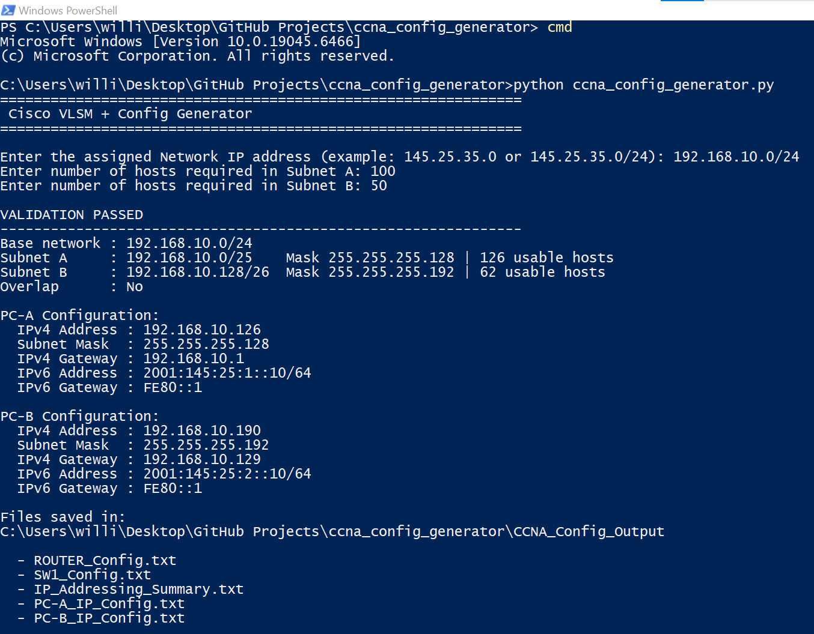
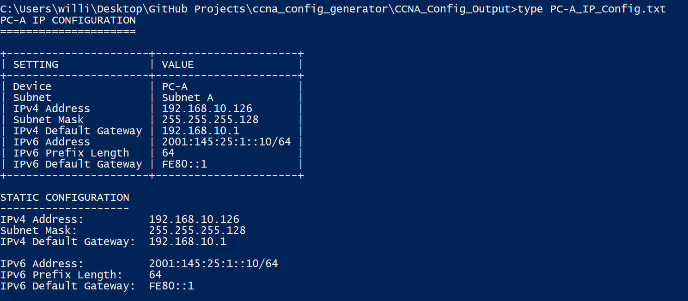
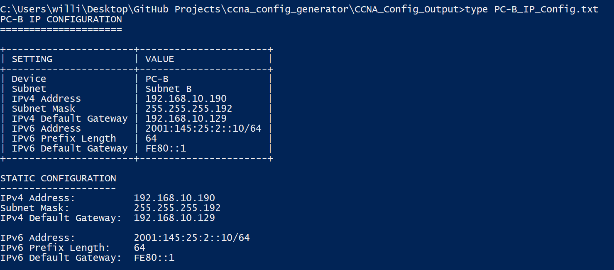
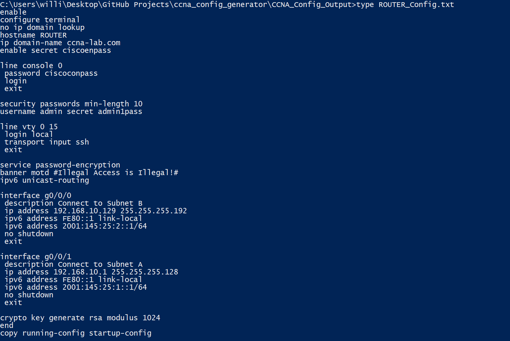
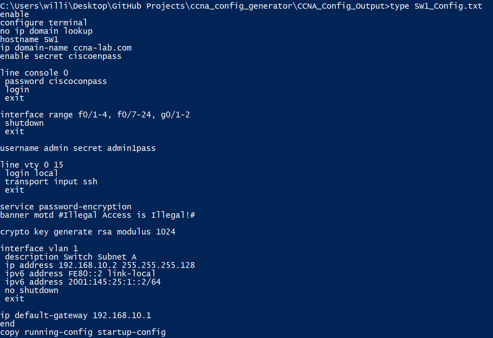
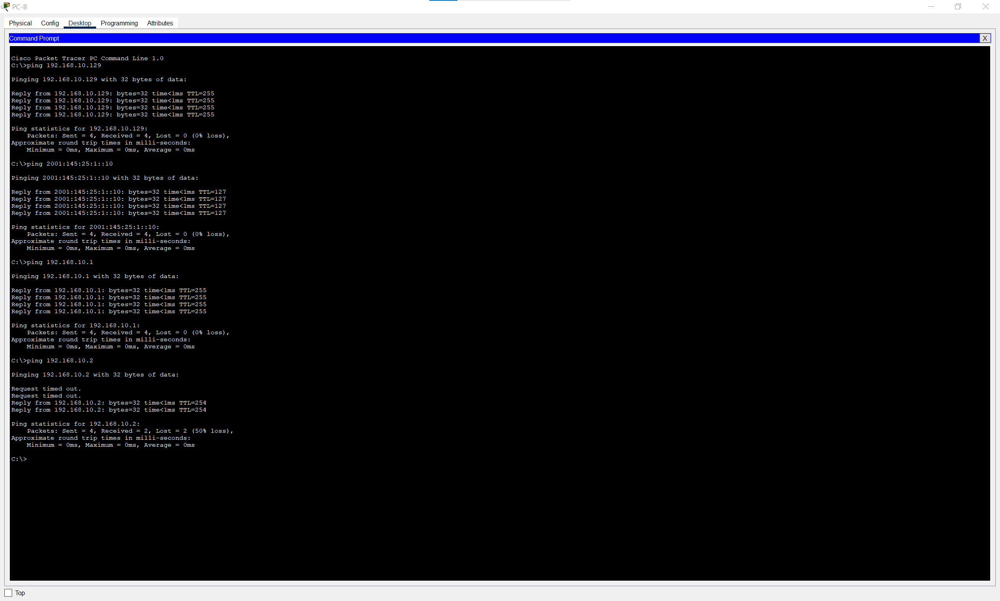

# CCNA Two-Subnet Config Generator

A Python-based **two-subnet VLSM calculator and Cisco configuration generator** designed for CCNA networking labs.

The program takes an assigned IPv4 network and host requirements for **Subnet A** and **Subnet B**, calculates the appropriate VLSM addressing, and automatically generates ready-to-use configuration files for a Cisco router, Cisco switch, PC-A, and PC-B.

IPv4 and IPv6 addressing are included, along with validation to ensure that both requested subnets fit inside the assigned network without overlapping.

> **Scope:** This project is intentionally designed for a two-subnet CCNA topology consisting of Subnet A and Subnet B. It is not a general-purpose multi-subnet VLSM network designer.

---

## Features

- Calculates two VLSM subnets automatically
- Accepts an IPv4 network address or CIDR notation
- Assumes `/24` when only a network address is entered
- Accepts separate host requirements for Subnet A and Subnet B
- Automatically determines the smallest valid subnet for each requirement
- Allocates the largest subnet first
- Calculates network and broadcast addresses
- Calculates first, second, and last usable IPv4 addresses
- Calculates usable host capacity
- Prevents overlapping subnets
- Detects when both subnet requirements cannot fit in the assigned network
- Generates Cisco IOS router configuration
- Generates Cisco IOS switch configuration
- Generates PC-A and PC-B configuration tables
- Includes IPv4 and IPv6 addressing
- Generates a complete addressing summary
- Saves generated configurations as `.txt` files
- Uses only the Python standard library

---

## Requirements

- Python 3
- Cisco Packet Tracer is recommended for testing

No external Python packages are required.

---

## Usage

Clone the repository:

```bash
git clone https://github.com/YOUR-USERNAME/ccna-two-subnet-config-generator.git
cd ccna-two-subnet-config-generator
```

Run the program:

```bash
python ccna_config_generator.py
```

The program asks for three values:

```text
Enter the assigned Network IP address:
Enter number of hosts required in Subnet A:
Enter number of hosts required in Subnet B:
```

### Example

```text
Enter the assigned Network IP address
(example: 145.25.35.0 or 145.25.35.0/24): 192.168.10.0/24

Enter number of hosts required in Subnet A: 100
Enter number of hosts required in Subnet B: 50
```

---

## Example VLSM Calculation

Using:

```text
Base Network:   192.168.10.0/24
Subnet A Hosts: 100
Subnet B Hosts: 50
```

the program calculates:

| Subnet | Network | Subnet Mask | Usable Hosts |
|---|---|---|---:|
| Subnet A | 192.168.10.0/25 | 255.255.255.128 | 126 |
| Subnet B | 192.168.10.128/26 | 255.255.255.192 | 62 |

### Why Subnet A Uses /25

Subnet A requires 100 hosts.

```text
100 hosts
+ 2 addresses for network and broadcast
= 102 addresses required
```

The next power of two is:

```text
128 addresses
```

Therefore:

```text
Prefix:          /25
Subnet Mask:     255.255.255.128
Total Addresses: 128
Usable Hosts:    126
```

### Why Subnet B Uses /26

Subnet B requires 50 hosts.

```text
50 hosts
+ 2 addresses for network and broadcast
= 52 addresses required
```

The next power of two is:

```text
64 addresses
```

Therefore:

```text
Prefix:          /26
Subnet Mask:     255.255.255.192
Total Addresses: 64
Usable Hosts:    62
```

---

## Address Assignment Logic

The program follows a consistent addressing model.

### Subnet A

- First usable IPv4 address → Router G0/0/1
- Second usable IPv4 address → SW1 VLAN 1
- Last usable IPv4 address → PC-A

### Subnet B

- First usable IPv4 address → Router G0/0/0
- Last usable IPv4 address → PC-B

For the example network, this produces:

| Device | Interface | IPv4 Address | IPv6 Address |
|---|---|---|---|
| Router | G0/0/1 | 192.168.10.1/25 | 2001:145:25:1::1/64 |
| SW1 | VLAN 1 | 192.168.10.2/25 | 2001:145:25:1::2/64 |
| PC-A | NIC | 192.168.10.126/25 | 2001:145:25:1::10/64 |
| Router | G0/0/0 | 192.168.10.129/26 | 2001:145:25:2::1/64 |
| PC-B | NIC | 192.168.10.190/26 | 2001:145:25:2::10/64 |

### IPv6 Networks

```text
Subnet A: 2001:145:25:1::/64
Subnet B: 2001:145:25:2::/64
```

Router link-local address:

```text
FE80::1
```

Switch link-local address:

```text
FE80::2
```

---

## Generated Files

After validation succeeds, the program automatically creates:

```text
CCNA_Config_Output/
│
├── ROUTER_Config.txt
├── SW1_Config.txt
├── IP_Addressing_Summary.txt
├── PC-A_IP_Config.txt
└── PC-B_IP_Config.txt
```

---

## Router Configuration

`ROUTER_Config.txt` generates Cisco IOS configuration for both routed subnets.

It includes:

- Router hostname
- Domain name
- Enable secret
- Console authentication
- Local administrator account
- SSH-only VTY access
- RSA key generation
- Password encryption
- MOTD banner
- IPv6 unicast routing
- IPv4 interface addressing
- IPv6 global addressing
- IPv6 link-local addressing
- Interface activation
- Startup configuration save

### Subnet A Example

```text
interface g0/0/1
 description Connect to Subnet A
 ip address 192.168.10.1 255.255.255.128
 ipv6 address FE80::1 link-local
 ipv6 address 2001:145:25:1::1/64
 no shutdown
 exit
```

### Subnet B Example

```text
interface g0/0/0
 description Connect to Subnet B
 ip address 192.168.10.129 255.255.255.192
 ipv6 address FE80::1 link-local
 ipv6 address 2001:145:25:2::1/64
 no shutdown
 exit
```

---

## Switch Configuration

`SW1_Config.txt` generates the Cisco IOS configuration for the switch.

The configuration includes:

- Hostname
- Domain name
- Enable secret
- Console authentication
- Local administrator account
- SSH-only VTY access
- Password encryption
- MOTD banner
- RSA key generation
- Shutdown of unused interfaces
- VLAN 1 management configuration
- IPv4 management address
- IPv6 global address
- IPv6 link-local address
- IPv4 default gateway

Example:

```text
interface vlan 1
 description Switch Subnet A
 ip address 192.168.10.2 255.255.255.128
 ipv6 address FE80::2 link-local
 ipv6 address 2001:145:25:1::2/64
 no shutdown
 exit

ip default-gateway 192.168.10.1
```

---

## PC-A Configuration

`PC-A_IP_Config.txt` provides the addressing information required to statically configure PC-A.

Example:

```text
PC-A IP CONFIGURATION
=====================

+----------------------+-----------------------+
| SETTING              | VALUE                 |
+----------------------+-----------------------+
| Device               | PC-A                  |
| Subnet               | Subnet A              |
| IPv4 Address         | 192.168.10.126        |
| Subnet Mask          | 255.255.255.128       |
| IPv4 Default Gateway | 192.168.10.1          |
| IPv6 Address         | 2001:145:25:1::10/64  |
| IPv6 Prefix Length   | 64                    |
| IPv6 Default Gateway | FE80::1               |
+----------------------+-----------------------+
```

---

## PC-B Configuration

`PC-B_IP_Config.txt` provides the addressing information required to statically configure PC-B.

Example:

```text
PC-B IP CONFIGURATION
=====================

+----------------------+-----------------------+
| SETTING              | VALUE                 |
+----------------------+-----------------------+
| Device               | PC-B                  |
| Subnet               | Subnet B              |
| IPv4 Address         | 192.168.10.190        |
| Subnet Mask          | 255.255.255.192       |
| IPv4 Default Gateway | 192.168.10.129        |
| IPv6 Address         | 2001:145:25:2::10/64  |
| IPv6 Prefix Length   | 64                    |
| IPv6 Default Gateway | FE80::1               |
+----------------------+-----------------------+
```

---

## IP Addressing Summary

`IP_Addressing_Summary.txt` provides a consolidated reference containing:

- Assigned base network
- Required hosts
- Subnet bits
- Binary subnet masks
- Decimal subnet masks
- CIDR prefixes
- Usable host capacities
- Network addresses
- First usable addresses
- Last usable addresses
- Broadcast addresses
- Router addresses
- Switch management address
- PC addresses
- IPv6 networks
- IPv6 addresses

---

## Validation

The generator validates the addressing requirements before creating configuration files.

If Subnet A and Subnet B cannot both fit inside the assigned network, the program stops and reports an error instead of generating invalid configurations.

For example:

```text
ERROR: The requested Subnet A and Subnet B host counts
do not fit inside 192.168.10.0/24.

No configuration files were created.
```

The program also verifies that the calculated Subnet A and Subnet B networks do not overlap.

A successful calculation displays:

```text
VALIDATION PASSED
--------------------------------------------------------------
Base network : 192.168.10.0/24
Subnet A     : 192.168.10.0/25
Subnet B     : 192.168.10.128/26
Overlap      : No
```

---

## Screenshots

### CCNA Config Generator

The program calculates both VLSM networks, validates the results, displays the PC configurations, and creates the configuration files.



### PC-A Configuration



### PC-B Configuration



### Router Configuration



### Switch Configuration



---

## Cisco Packet Tracer Testing

The generated configurations were tested using Cisco Packet Tracer.

The test topology demonstrates communication between the two IPv4 subnets and their corresponding IPv6 networks.

### Connectivity Testing from PC-A


Testing from PC-A includes connectivity to:

```text
192.168.10.129
2001:145:25:2::10
192.168.10.1
192.168.10.2
192.168.10.190
```

This verifies communication with:

- Subnet B's router interface
- PC-B over IPv6
- Subnet A's router interface
- SW1
- PC-B over IPv4

Initial ICMP packets may time out while ARP or IPv6 Neighbor Discovery resolves the destination.

### Connectivity Testing from PC-B



Testing from PC-B includes connectivity to:

```text
192.168.10.129
2001:145:25:1::10
192.168.10.1
192.168.10.2
```

This demonstrates routed IPv4 and IPv6 communication between Subnet A and Subnet B.

---

## How VLSM Allocation Works

The generator sorts the two requested subnet sizes so that the **larger subnet is allocated first**.

This prevents the smaller subnet from unnecessarily fragmenting the available IPv4 address space.

For example:

```text
192.168.10.0/24
```

with:

```text
Subnet A = 100 hosts
Subnet B = 50 hosts
```

becomes:

```text
192.168.10.0/24
│
├── Subnet A
│   └── 192.168.10.0/25
│
└── Subnet B
    └── 192.168.10.128/26
```

The remaining addresses are not assigned by this two-subnet generator.

---

## Current Scope and Limitations

This project is specifically designed for a **two-subnet CCNA lab topology**.

It currently supports:

```text
Subnet A
Subnet B
PC-A
PC-B
SW1
One Cisco router
```

It does **not** currently generate arbitrary numbers of VLSM subnets, VLANs, router subinterfaces, or multi-router topologies.

This limitation is intentional so that the generated configuration remains aligned with the two-subnet lab topology for which the project was designed.

---

## Project Purpose

This project demonstrates practical networking and automation skills including:

- IPv4 subnetting
- Variable Length Subnet Masking (VLSM)
- IPv6 addressing
- Cisco IOS configuration
- Router interface configuration
- Switch management configuration
- SSH configuration
- Network validation
- ICMP connectivity testing
- Cisco Packet Tracer
- Python scripting
- Input validation
- Automated configuration generation
- File generation

The goal is to automate repetitive subnetting and configuration work while maintaining a clear relationship between the calculated addresses and the resulting Cisco IOS configurations.

---

## Repository Structure

```text
ccna-two-subnet-config-generator/
│
├── ccna_config_generator.py
├── README.md
├── .gitignore
│
└── screenshots/
    ├── ccna-config-generator.png
    ├── pc-a-config.png
    ├── pc-b-config.png
    ├── router-config.png
    ├── sw1-config.png
    ├── ping-from-pc-a.png
    └── ping-from-pc-b.png
```

---

## Disclaimer

This project is intended for educational, CCNA lab, and portfolio use.

Generated Cisco IOS commands should always be reviewed before being applied to production networking equipment.
